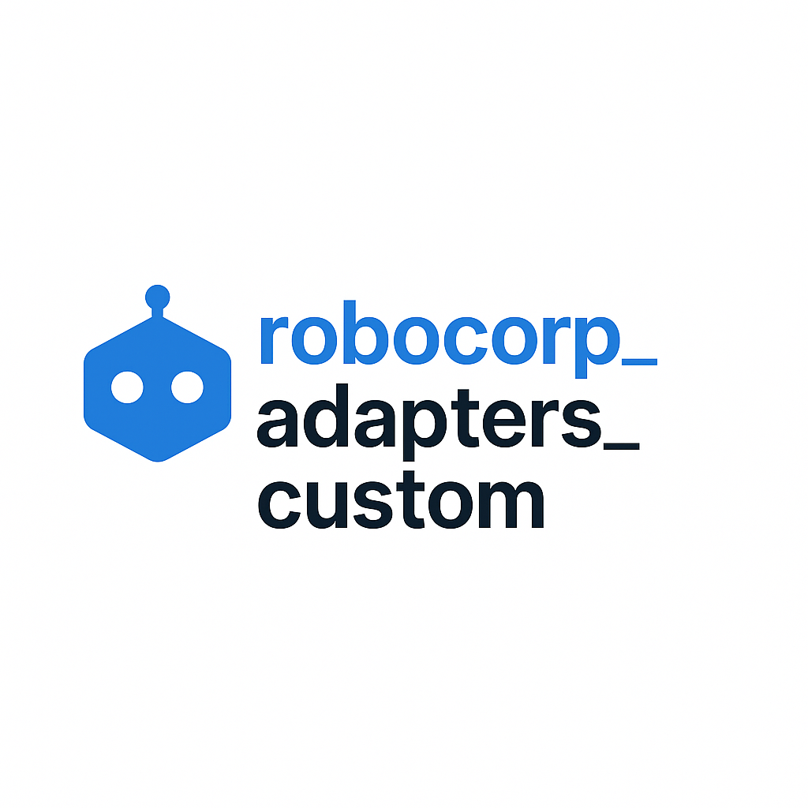

# 
# robocorp_adapters_custom

Custom Work Item Adapters for Robocorp Producer-Consumer Automation

---

## Installation

### As a Python Package (Recommended)

Install directly using pip:

```bash
# Basic installation (includes SQLite adapter)
pip install robocorp-adapters-custom

# With Redis support
pip install robocorp-adapters-custom[redis]

# With MongoDB/DocumentDB support
pip install robocorp-adapters-custom[mongodb]

# With all optional adapters
pip install robocorp-adapters-custom[all]
```

**Quick Usage:**

```python
import os
from robocorp_adapters_custom import get_adapter_instance, State

# Configure your adapter
os.environ["RC_WORKITEM_ADAPTER"] = "robocorp_adapters_custom._sqlite.SQLiteAdapter"
os.environ["RC_WORKITEM_DB_PATH"] = "work_items.db"
os.environ["RC_WORKITEM_QUEUE_NAME"] = "my_queue"

# Use the adapter
adapter = get_adapter_instance()
item_id = adapter.reserve_input()
payload = adapter.load_payload(item_id)
# ... process work item ...
adapter.release_input(item_id, State.DONE)
```

For detailed installation instructions, see [INSTALLATION.md](INSTALLATION.md).

### From Source (Development)

Clone the repository for development:

```bash
git clone https://github.com/joshyorko/robocorp_adapters_custom.git
cd robocorp_adapters_custom
pip install -e .[dev]
```

---

## Overview
This repository provides custom adapters for Robocorp's workitems library, enabling scalable producer-consumer automation workflows with pluggable backend support (SQLite, Redis, Amazon DocumentDB/MongoDB, Yorko Control Room, etc.). The architecture is designed for easy backend switching via environment variables, supporting both local development and distributed cloud deployments.

## Features
- **Pluggable Adapter Pattern**: Easily switch between SQLite, Redis, Amazon DocumentDB/MongoDB, Yorko Control Room, and other backends by changing environment variables.
- **Producer-Consumer Workflows**: Modular tasks for producing, consuming, and reporting on work items.
- **Control Room Integration**: Connect robots to self-hosted Yorko Control Room via REST API.
- **Orphan Recovery**: Built-in scripts and adapter logic for recovering orphaned work items.
- **File Attachments**: Hybrid storage (inline for small files, GridFS for large files in DocumentDB, filesystem for other adapters).
- **Automatic Schema Migration**: SQLite adapter supports seamless schema upgrades.
- **Distributed Processing**: Redis and DocumentDB adapters enable high-throughput, multi-worker scaling.
- **Cloud-Native Support**: DocumentDB adapter optimized for AWS environments with TLS/SSL encryption and replica set support.

## Key Components
- `_sqlite.py`, `_redis.py`, `_docdb.py`, `_yorko_control_room.py`: Custom adapters implementing the `BaseAdapter` interface.
- `workitems_integration.py`: Dynamic adapter loader for seamless backend switching.
- `scripts/config.py`: Loads and validates environment-based configuration.
- `scripts/seed_sqlite_db.py`, `scripts/seed_redis_db.py`, `scripts/seed_docdb_db.py`: Seed scripts for populating test data.
- `yamls/robot.yaml`, `yamls/conda.yaml`: Task and environment definitions for RCC workflows.
- `devdata/`: Environment configs, input/output data, and test artifacts.
- `docs/`: Implementation guides and architecture documentation.

## Getting Started

### Quick Integration (Using pip)

The easiest way to use these adapters in your Robocorp project:

1. **Install the package** in your project environment:
   ```bash
   pip install robocorp-adapters-custom[all]
   ```

2. **Configure the adapter** via environment variables:
   ```bash
   export RC_WORKITEM_ADAPTER=robocorp_adapters_custom._sqlite.SQLiteAdapter
   export RC_WORKITEM_DB_PATH=work_items.db
   export RC_WORKITEM_QUEUE_NAME=my_queue
   ```

3. **Use in your code**:
   ```python
   from robocorp_adapters_custom import get_adapter_instance
   adapter = get_adapter_instance()
   ```

No code changes required—just install, configure, and go!

### Alternative: Using from Repository

If you prefer to work directly from source:

1. **Clone this repository** into your project or workspace.
2. **Set the adapter class** via environment variable:
   - SQLite: `robocorp_adapters_custom._sqlite.SQLiteAdapter`
   - Redis: `robocorp_adapters_custom._redis.RedisAdapter`
   - DocumentDB/MongoDB: `robocorp_adapters_custom._docdb.DocumentDBAdapter`
   - Yorko Control Room: `robocorp_adapters_custom._yorko_control_room.YorkoControlRoomAdapter`
3. **Use pre-configured environment files** from `devdata/` for quick setup.

### 1. Environment Setup
- Install the package with `pip install robocorp-adapters-custom[all]`
- Or clone the repository and install dependencies using the provided `conda.yaml`.
- Configure environment variables for your chosen adapter (see below).

### 2. Adapter Selection
Set the `RC_WORKITEM_ADAPTER` environment variable to select your backend:
- **SQLite**: `robocorp_adapters_custom._sqlite.SQLiteAdapter`
- **Redis**: `robocorp_adapters_custom._redis.RedisAdapter`
- **DocumentDB/MongoDB**: `robocorp_adapters_custom._docdb.DocumentDBAdapter`
- **Yorko Control Room**: `robocorp_adapters_custom._yorko_control_room.YorkoControlRoomAdapter`

Other required variables:
- **SQLite**: `RC_WORKITEM_DB_PATH=devdata/work_items.db`
- **Redis**: `REDIS_HOST=localhost`
- **DocumentDB**: `DOCDB_HOSTNAME=localhost`, `DOCDB_PORT=27017`, `DOCDB_USERNAME=<user>`, `DOCDB_PASSWORD=<pass>`, `DOCDB_DATABASE=<dbname>`
  - For AWS DocumentDB: Also set `DOCDB_TLS_CERT=<path/to/rds-combined-ca-bundle.pem>`
  - Alternatively, use: `DOCDB_URI=mongodb://<user>:<pass>@<host>:<port>/?ssl=true`
- **Yorko Control Room**: `YORKO_API_URL=http://localhost:8000`, `YORKO_API_TOKEN=<token>`, `YORKO_WORKSPACE_ID=<uuid>`, `YORKO_WORKER_ID=<worker-id>`

### 3. Running Tasks
Use RCC or the `robot.yaml` tasks:

**SQLite:**
```sh
rcc run -t Producer -e devdata/env-sqlite-producer.json
rcc run -t Consumer -e devdata/env-sqlite-consumer.json
rcc run -t Reporter -e devdata/env-sqlite-for-reporter.json
```

**Redis:**
```sh
rcc run -t Producer -e devdata/env-redis-producer.json
rcc run -t Consumer -e devdata/env-redis-consumer.json
rcc run -t Reporter -e devdata/env-redis-reporter.json
```

**DocumentDB/MongoDB:**
```sh
rcc run -t Producer -e devdata/env-docdb-local-producer.json
rcc run -t Consumer -e devdata/env-docdb-local-consumer.json
rcc run -t Reporter -e devdata/env-docdb-local-reporter.json
```

**Yorko Control Room:**
```sh
rcc run -t Producer -e devdata/env-yorko-control-room-producer.json
rcc run -t Consumer -e devdata/env-yorko-control-room-consumer.json
```
See [Yorko Control Room Adapter Guide](docs/YORKO_CONTROL_ROOM_ADAPTER.md) for detailed setup.

### 4. Seeding and Debugging
- Seed SQLite: `python scripts/seed_sqlite_db.py`
- Seed Redis: `python scripts/seed_redis_db.py`
- Seed DocumentDB: `python scripts/seed_docdb_db.py` (or with custom env: `python scripts/seed_docdb_db.py --env devdata/env-docdb-local-producer.json`)
- Check DB: `python scripts/check_sqlite_db.py`
- Recover Orphans: `python scripts/recover_orphaned_items.py`
- Diagnose Reporter: `python scripts/diagnose_reporter_issue.py`

## Project Conventions
- All configuration is via environment variables (see `scripts/config.py`).
- Queue names are set by `RC_WORKITEM_QUEUE_NAME`.
- File attachments:
  - SQLite/Redis: Large files stored on disk, small files inline
  - DocumentDB: Large files stored in GridFS (>1MB), small files inline (base64)
- Adapters must implement 9 methods (see `docs/ADAPTER_RESEARCH_SUMMARY.md`).
- Switching backends requires only env var changes—no code changes.

## Adapter Comparison

| Feature | SQLite | Redis | DocumentDB/MongoDB |
|---------|--------|-------|-------------------|
| **Best For** | Local development, single-worker | High-throughput, multi-worker | AWS-native, distributed processing |
| **Scalability** | Single process | Horizontal scaling | Horizontal scaling with replica sets |
| **Persistence** | File-based | In-memory (optional persistence) | Durable, replicated storage |
| **File Storage** | Filesystem | Filesystem | GridFS (integrated) |
| **Cloud Integration** | N/A | ElastiCache support | Native AWS DocumentDB |
| **TLS/SSL** | N/A | Supported | Required for AWS DocumentDB |
| **Setup Complexity** | Low | Medium | Medium-High |
| **Dependencies** | None (stdlib) | `redis-py` | `pymongo` |

### When to Use DocumentDB/MongoDB Adapter
- **AWS Environments**: Native integration with Amazon DocumentDB clusters
- **Multi-Region Deployments**: Replica set support for high availability
- **Large File Handling**: Built-in GridFS for efficient large file storage (>1MB)
- **Enterprise Features**: TLS/SSL encryption, connection pooling, and automatic failover
- **MongoDB Compatibility**: Drop-in replacement for existing MongoDB-based workflows

## References & Documentation
- **Installation Guide**: [INSTALLATION.md](INSTALLATION.md) - Complete installation and setup instructions
- **Adapter Implementation**: [docs/CUSTOM_WORKITEM_ADAPTER_GUIDE.md](docs/CUSTOM_WORKITEM_ADAPTER_GUIDE.md)
- **Adapter Interface**: [docs/ADAPTER_RESEARCH_SUMMARY.md](docs/ADAPTER_RESEARCH_SUMMARY.md)
- **Producer-Consumer Architecture**: [docs/# Producer-Consumer Architecture Migrati.md](docs/# Producer-Consumer Architecture Migrati.md)
- **Task Definitions**: [yamls/robot.yaml](yamls/robot.yaml)
- **Environment Setup**: [yamls/conda.yaml](yamls/conda.yaml), [devdata/](devdata/)

## License
[MIT](LICENSE)

---
**Tip:** For quick start, see [INSTALLATION.md](INSTALLATION.md). For development from source, check the relevant YAML and devdata files for environment setup and test data.
